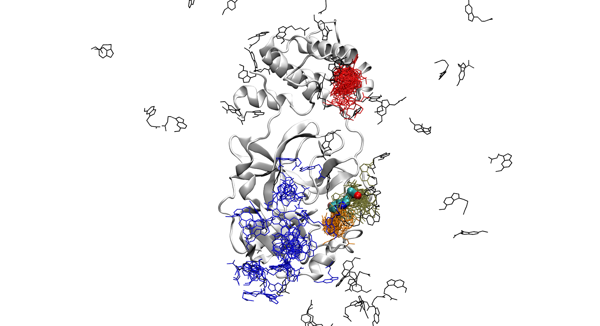

# covid19

All data available in this repository is provided  under the Creative Commons Attribution 4.0 International Public License https://creativecommons.org/licenses/by/4.0/legalcode.

## Methods

### Screening

A library of FDA approved drugs was downloaded from [Enamine Store](https://www.enaminestore.com/platedsets/fda-approved). Fingeprints were computed with RdKit's function Chem.RDKFingerprint for all the molecules in the library, as well as for the fragments that had crystallized to the main protease of the virus, available [here](https://www.diamond.ac.uk/covid-19/for-scientists/Main-protease-structure-and-XChem/Downloads.html). Finally, we computed similarity for each possible pair and the we decided to focus on melatonin, given its similarity to fragment x0104.

### Simulation preparation

The protein (Mpro-x0104) was protonated at pH 7.0 using [ProteinPrepare](https://playmolecule.org/proteinPrepare/), to be then modeled using the AMBER99SB force field. The ligand (melatonin) was modeled with the general amber force field (GAFF) using [Parameterize](https://software.acellera.com/docs/latest/parameterize/index.html). The ligand was placed in the bulk in a random orientation. The complex was then solvated with TIP3P water molecules and neutralized.

3 nanoseconds of equilibration were run at 310K using ACEMD. Constraints on the heavy atoms of the protein were applied during the first half of the equilibration, 1 kcal * mol−1 * Å−2 for the alpha carbons and 0.1 for all others. This equilibration step was followed by 10 ns of simulation under production conditions (no constraints). This production simulation was used as the generator of our AdaptiveGoal protocol.

### AdaptiveGoal

AdaptiveGoal protocol runs several simulations in parallel, and when a given number of simulations finishes, new simulations are launched. The key is that this new round (or epoch) of simulations starts from one of the frames of the previoulsy finished simulations. The protocol assigns a score to each frame, and the new round of simulations starts from the frames with highest score. The score of each frame is computed by an arbitrary, user-defined function. In this case, we gave a score of 1.0 to every frame where the ligand was closer than 20.0 Å to the binding site (defined by the location of Histidine 41 in the original structure) and the value of that distance multiplied by -1 if it was further away. Hence, once the ligand enters the sphere of 20 Å centered in the binding site, subsequent rounds of simulations will focus on exploring that area. This helps saving GPU time.

